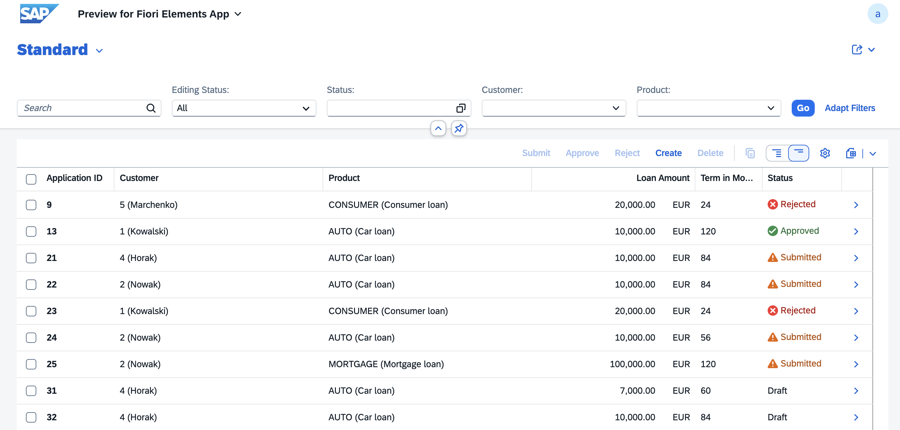
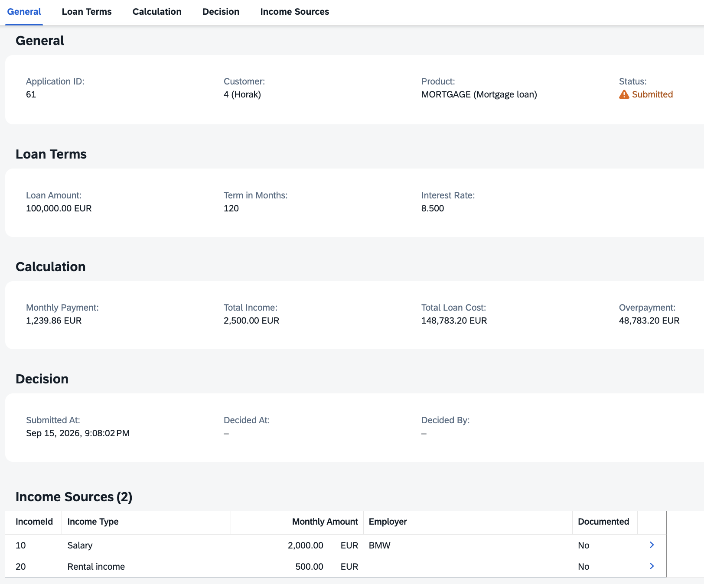
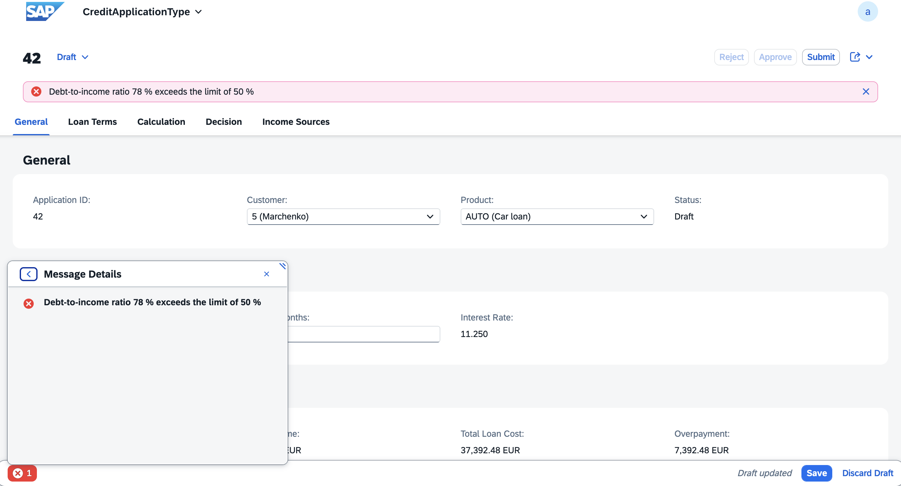
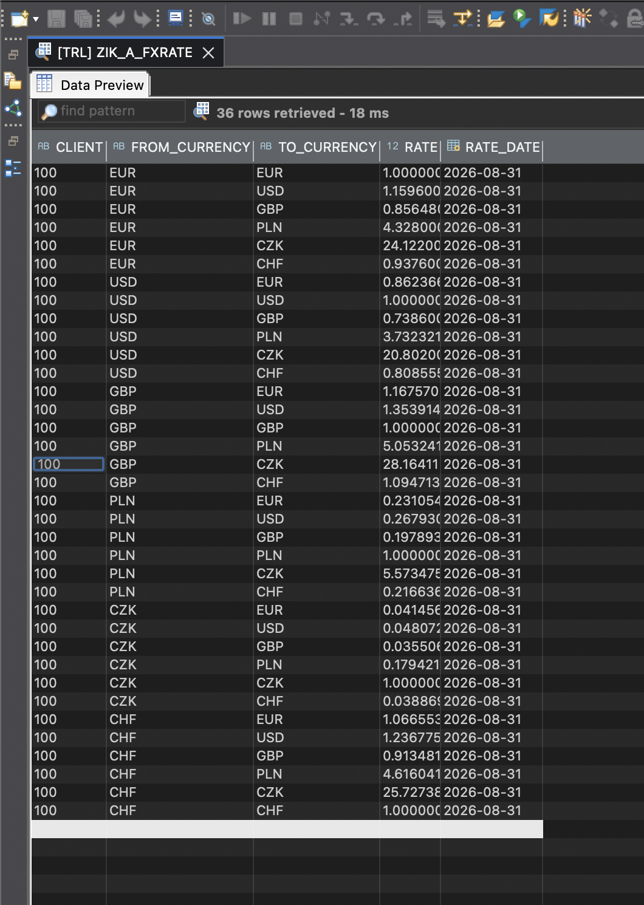
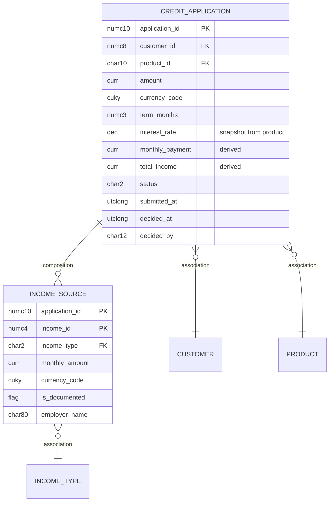

# Credit Application — SAP RAP on ABAP Cloud

A managed, draft-enabled RAP business object for a consumer loan application: product limits, multi-currency income, debt-to-income scoring and an approval lifecycle.

**SAP BTP ABAP Environment · ABAP for Cloud Development · RAP (managed, draft) · CDS · OData V4 · Fiori Elements · ABAP Unit · abapGit**

---

## Screens



*List report: filter bar, status criticality across all four states, and the actions available for the selected application.*



*Object page: loan terms, derived figures and the income sources of the application.*

| | |
|---|---|
|  |  |
| Debt-to-income refusal as a draft state message | Rate cache after a live load |

---

## Business scenario

An applicant creates a loan application, picks a credit product and declares one or more income sources. The system snapshots the product's interest rate, calculates the annuity payment, converts all income into the loan currency and checks the debt-to-income ratio.

The shipped products are a consumer loan (1,000–50,000 EUR over 6–60 months at 15.9%), a mortgage (50,000–1,000,000 EUR over 60–360 months at 8.5%) and a car loan (5,000–150,000 EUR over 12–84 months at 11.25%). An application is refused once the monthly payment exceeds **50%** of converted monthly income, or when the amount or term falls outside the chosen product's range.

```
DR (draft) --Submit--> SU (submitted) --Approve--> AP (approved)
                                      --Reject---> RJ (rejected)
```

Editing is possible only in `DR`. A submitted application is frozen while under review, and the person who created it cannot decide on it.

---

## Data model



Administrative fields — created by and at, last changed by and at, local last changed at — are present on both entities and omitted here for readability.

The model carries both a composition (application → income sources) and plain associations (→ customer, → product). The composition owns the lifecycle of its children; the associations only navigate.

The loan carries its own currency and so does each income source, so every debt-to-income check runs through an actual conversion.

---

## RAP features and where they live

| Feature | Objects |
|---|---|
| Managed BO, draft, `strict ( 2 )` | `ZIK_I_CREDAPP` (BDEF), `ZBP_IK_I_CREDAPP` (behaviour pool) |
| Projection layer | `ZIK_C_CREDAPP`, `ZIK_C_INCOME` + BDEF `ZIK_C_CREDAPP` |
| Early numbering | `earlynumbering_create` via number range `ZIK_CRDAPP`; `earlynumbering_cba_Income` via `max + 10` |
| Determinations | `setInitialStatus`, `copyInterestRate`, `calculateMonthlyPayment`, `calculateTotalIncome` (child), `recalculateTotalIncome` (root) — shared logic in local class `lcl_income_total` |
| Validations | `validateProduct`, `validateCustomer`, `validateAmount`, `validateTerm`, `validateDTI`, bound to `Prepare`, reported as draft state messages via `%state_area` |
| Actions | `Submit`, `Approve`, `Reject` + private helper `decide` |
| Feature control | `get_instance_features` |
| Authorization | `get_instance_authorizations` — instance authorization on data |
| Virtual elements | `ZIK_CL_CREDAPP_CALC` (`IF_SADL_EXIT_CALC_ELEMENT_READ`) — total cost, overpayment, status text and criticality |
| Side effects | `side effects` block in projection BDEF `ZIK_C_CREDAPP`, root and via association from the child |
| Value helps | `ZIK_I_CUSTOMER_VH`, `ZIK_I_PRODUCT_VH`, `ZIK_I_INCTYPE_VH`, `ZIK_I_CURRENCY_VH` |
| External integration | `ZIK_CL_FX_LOADER` — ECB reference rates via the Frankfurter API (HTTP + JSON); `ZIK_CL_FX_JOB` (Application Job interfaces); cache `ZIK_A_FXRATE` |
| Messages | `ZIK_CREDAPP` (001–011) |
| Unit tests | `LTC_CREDAPP` — local test class of `ZBP_IK_I_CREDAPP` |
| Service | `ZIK_UI_CREDAPP` / `ZIK_UI_CREDAPP_O4` (OData V4 UI) |

---

## Engineering decisions

**External calls stay outside the save sequence.** The save phase has a transactional contract that forbids them. Exchange rates are fetched by a standalone loader and cached in `ZIK_A_FXRATE`; determinations and validations read the cache.

**Cross rates are derived, not stored one-way.** Frankfurter serves ECB reference rates against a EUR base. The loader expands every ordered pair (`rate(A→B) = eurTo(B) / eurTo(A)`). Storing only `X → EUR` had silently converted at rate zero whenever the loan currency was not EUR.

**Derived values are virtual elements, not CDS-computed columns.** In a draft-enabled BO a computed element still needs a column in the draft table, and nothing fills it, so the value stays empty until activation. A virtual element is calculated on read by an exit class and behaves identically in draft and active state. The cost: it is invisible to plain ABAP SQL and cannot be sorted on.

**The currency value help reads the rate cache.** Only currencies that have a rate can be chosen, so the offered list and the loaded rates cannot drift apart.

**Number range buffering is a trade-off.** Application IDs come from a buffered number range, so gaps are possible. That is acceptable for an application number; a legal document number would need a gap-free interval.

**Status invariants are enforced twice.** Feature control hides the buttons, and the actions re-check the status themselves. Feature control is user experience and can be bypassed by calling the OData service directly; only the check inside the action is a boundary.

---

## Setup

Requires an **SAP BTP ABAP Environment** instance and ADT with the abapGit plugin.

1. Clone this repository into package `ZIK_BANK_CREDIT` using abapGit (online repository), then pull and activate. Language version must be **ABAP for Cloud Development**.
2. Create the number range interval: run `ZIK_CL_NR_SETUP`.
3. Load reference data: `ZIK_CL_DEMO_DATA`, then `ZIK_CL_INCTYPE_SEED`.
4. Load exchange rates: `ZIK_CL_FX_LOADER` pulls ECB reference rates via the Frankfurter API, or `ZIK_CL_FX_SEED` to work offline.
5. Publish the service binding `ZIK_UI_CREDAPP_O4` and open the Fiori Elements preview.

The loader calls `https://api.frankfurter.dev` through `cl_http_destination_provider=>create_by_url`. No destination or communication arrangement is needed. If the system does not already trust the host certificate, add it through the *Maintain Certificate Trust List* app.

To see the separation-of-duties check, run `ZIK_CL_FOREIGN_APP` — it seeds an application owned by another user, which can then be approved but not edited.

---

## Testing

`LTC_CREDAPP` calls the behaviour handler directly, with `cl_cds_test_environment` substituting the underlying persistence, so no real data is touched and `ROLLBACK ENTITIES` in teardown discards the buffer.

Covered: the debt-to-income validation across three cases, feature control in draft and submitted state, and `Submit` for both a legal and an illegal status transition.

---

## Repository tooling

Runnable helper classes (`if_oo_adt_classrun`, F9 in ADT). All are idempotent.

| Class | Purpose |
|---|---|
| `ZIK_CL_NR_SETUP` | Number range interval for `ZIK_CRDAPP` plus a smoke test |
| `ZIK_CL_DEMO_DATA` | Customers and credit products |
| `ZIK_CL_INCTYPE_SEED` | Income types |
| `ZIK_CL_FX_SEED` | Offline exchange rates, fallback for the live loader |
| `ZIK_CL_FX_LOADER` | Fetches ECB reference rates via the Frankfurter API and refreshes the cache |
| `ZIK_CL_FOREIGN_APP` | Seeds an application owned by a different user. Writes to the tables directly — the owner cannot be faked through the business object |
| `ZIK_CL_CCY_TEST` | Exercises the business object through EML, bypassing the UI: opens a draft with `EXECUTE Edit`, changes the loan currency, checks that total income is converted again, discards the draft. Written to prove that a "value not recalculating" symptom came from the UI layer, not from the determination |

---

## Deliberately out of scope

- **No `SU → DR` path.** A submitted application is frozen, so a typo can only be rejected and re-entered. A "return for correction" action would close the lifecycle.
- **Global authorization is a permissive stub.** Instance authorization is implemented on data; a real authorization object with the full IAM chain is not set up.
- **No CDS access control (DCL).** Restricting data through `define role` is a separate mechanism from the instance authorization implemented here.
- **FX has no history and no UAH.** The cache holds the latest snapshot with its date; a production system would need the rate as of the application date. UAH is not published by the ECB, so an application in UAH is refused with an explicit message rather than converted incorrectly.
- **No sorting on virtual elements.** Overpayment appears on the object page but not as a sortable list column.
